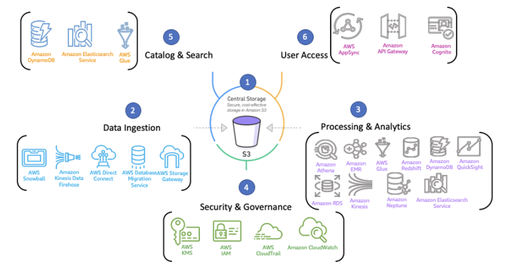

# Data Lakes

## Introduction

> Centralized repository which is used to store structured and unstructured data.

`Data Lake != Data Warehouse`

Data Lake == Schema on read.

> A Data Warehouse needs a data base structured since the beginning.

It is possible to store unstructured data to analyse them and use to different applications:
    - Dashboards and Data vizualization
    - Big data
    - Real time analysis
    - Machine Learning

## Data Lake environment

1. Central Storage (S3)
2. Data Ingestion
3. Processing & Analytics
4. Security & Governance
5. Catalog & Search
6. User Access

## Data Lake Layers

### Layer 1 - Raw, bronze

One or more buckets which store the data provided by the ingestors services.

> It is important in this layer the data be maintained in its original form, without any transformation.

*Who use it?*

- Data Engineers
- Job Spark

### Layer 2 - Processed, silver

Stores datasets resulting from the layer 1 transformation in column files using ETL (Spark or AWS Glue).

> Otimized data for reading

- More performance
- Less costs

*Who use it?*

- Data Scientist
- Job Spark
- DBT
- Athena

### Layer 3 - Curated, gold

Subgroup of Layer 2 that was used for specifics use.

> Used by many different stakeholders.

Dependind the use case can be served in many technologies:

- Amazon EMR
- Redshift
- Presto
- Athena

*Who use it?*

- Data Analysts
- Data Scientist
- DW
- BI Tools
